  <picture>
    <source media="(prefers-color-scheme: dark)" srcset="assets/name-dark.svg">
    
  </picture>

  <picture>
    <source media="(prefers-color-scheme: dark)" srcset="assets/tagline-dark.svg">
    
  </picture>

  
  
  

  

Banner, name and tagline animated with <a href="https://ascii.rest">ascii.rest</a>

